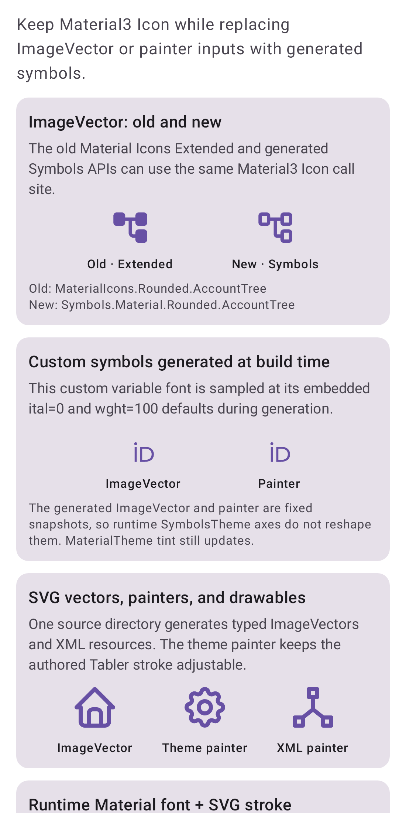
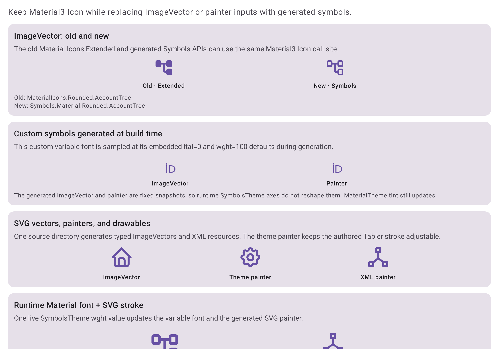
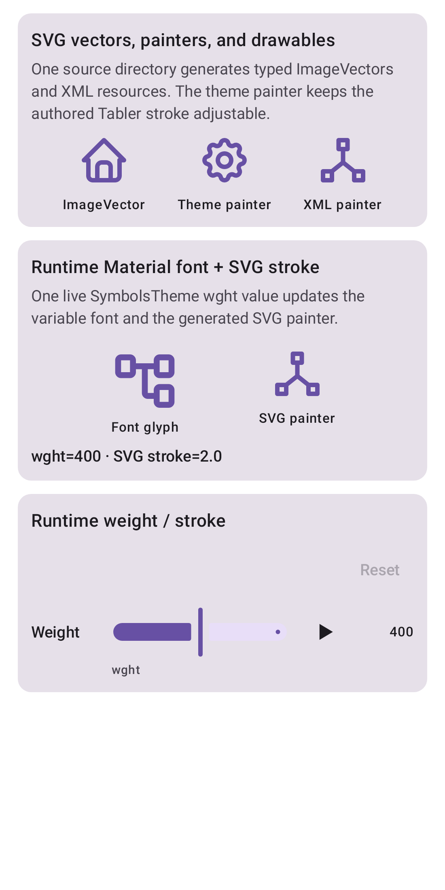
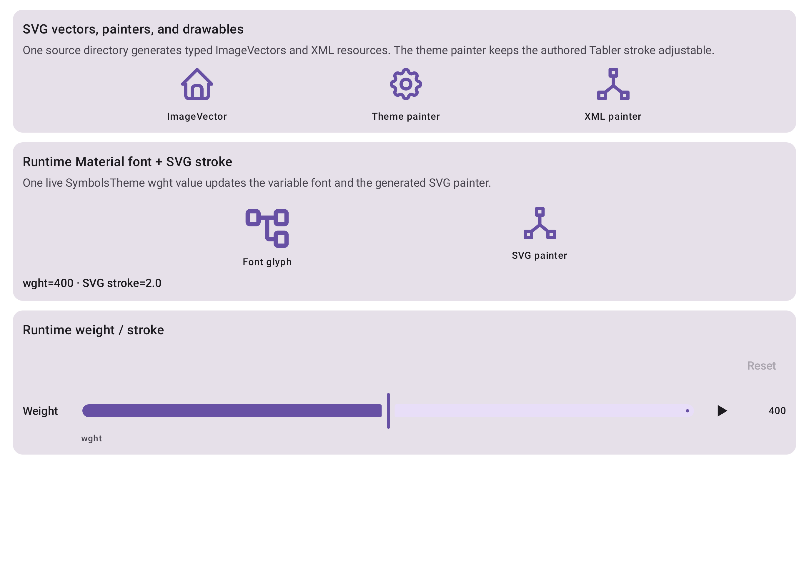

<!-- symbols-roborazzi-report -->
## Roborazzi previews

<!-- source:b6bf44ffcac437540bda663c8bc69559c5f0a372:c7c87419333a4c6249e13ed1add17d8a79817bf1 -->
PR commit: `b6bf44ffcac437540bda663c8bc69559c5f0a372` · Base: `c7c87419333a4c6249e13ed1add17d8a79817bf1`

Visual changes: **0**. Comparison: **success**.

Current PR previews (4)

io.github.hlcaptain.symbols.sample.imagevectormigration.ImageVectorMigrationSampleKt.ImageVectorMigrationPreview.Compact&#95;W400dp&#95;H800dp&#95;WITH&#95;BACKGROUND.png

io.github.hlcaptain.symbols.sample.imagevectormigration.ImageVectorMigrationSampleKt.ImageVectorMigrationPreview.Expanded&#95;W1000dp&#95;H700dp&#95;WITH&#95;BACKGROUND.png

io.github.hlcaptain.symbols.sample.imagevectormigration.SvgIconExamplesKt.SvgIconExamplesPreview.Compact&#95;W400dp&#95;H800dp&#95;WITH&#95;BACKGROUND.png

io.github.hlcaptain.symbols.sample.imagevectormigration.SvgIconExamplesKt.SvgIconExamplesPreview.Expanded&#95;W1000dp&#95;H700dp&#95;WITH&#95;BACKGROUND.png

